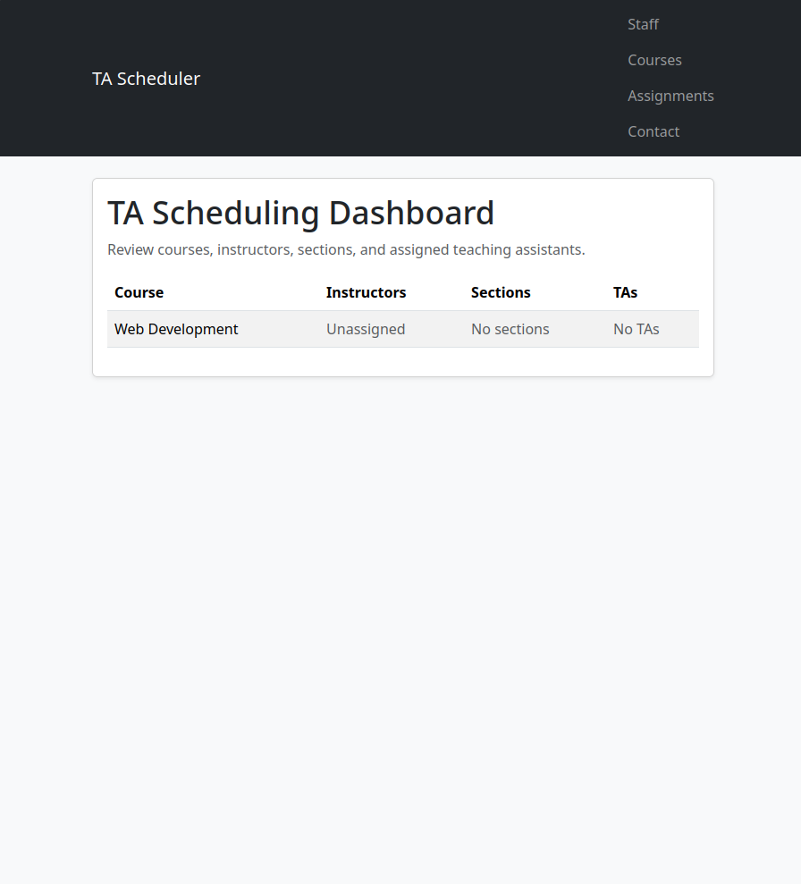
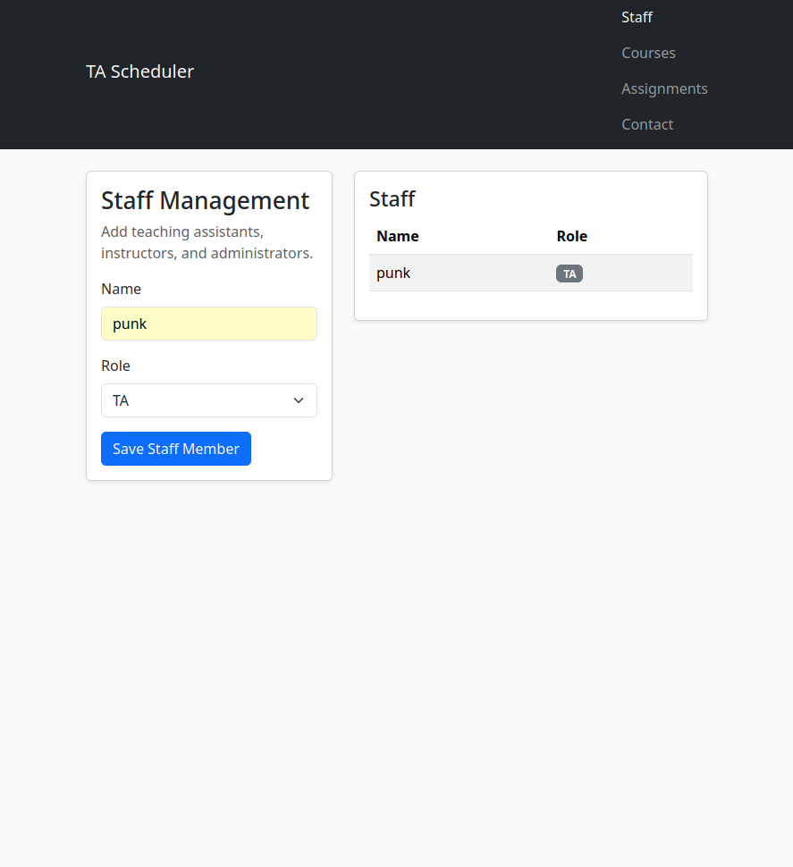
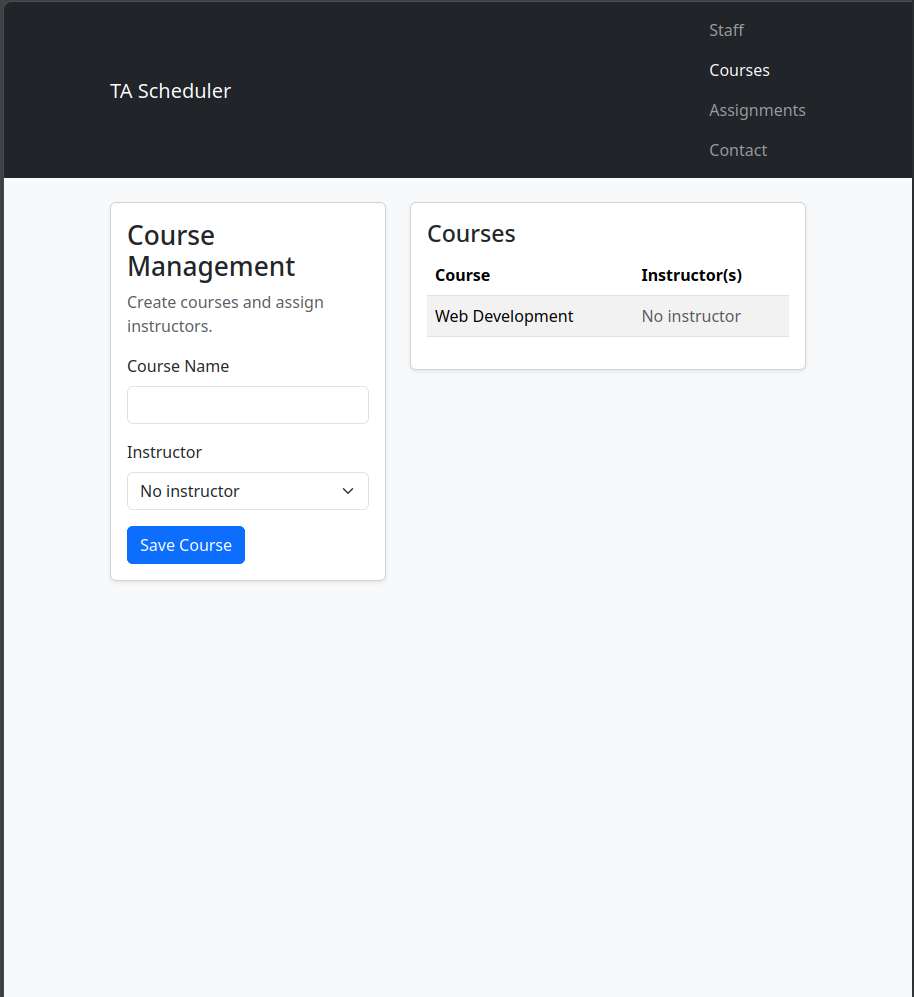
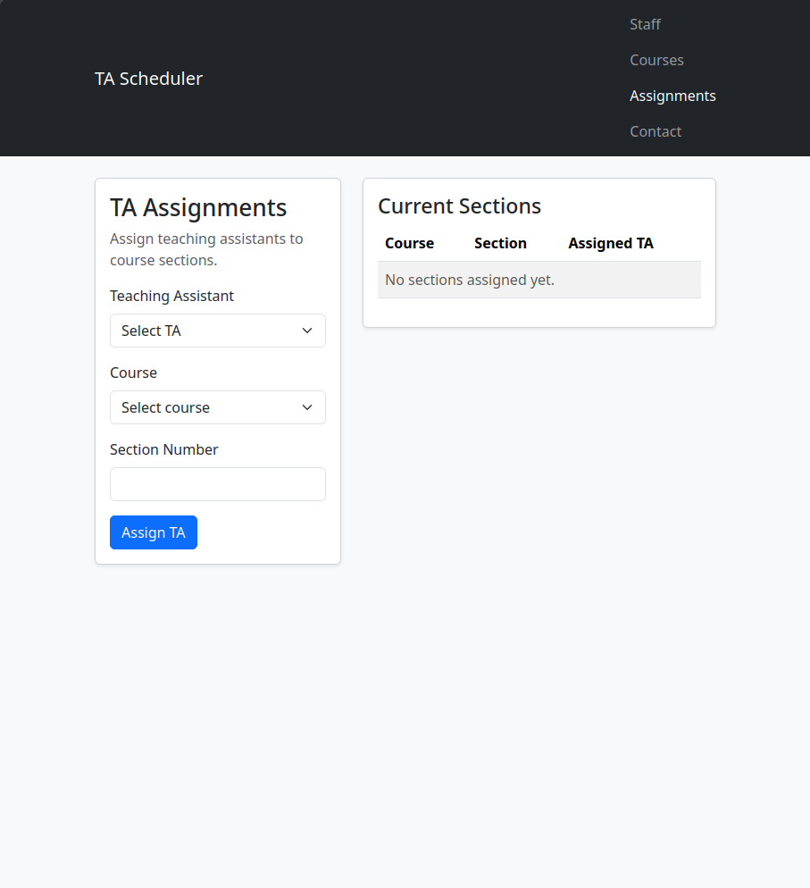

# TA Scheduling Dashboard

A Django-based academic scheduling dashboard for managing teaching assistants, instructors, courses, sections, and TA assignments.

This project began as a university group project and was later refactored into a cleaner portfolio project focused on Django fundamentals, ORM relationships, class-based views, template rendering, automated testing, and CI.

## Screenshots

### Dashboard



### Staff Management



### Course Management



### TA Assignments



## Features

- Staff management for TAs, instructors, and admins
- Course management with instructor assignment
- Section creation during TA assignment
- TA-to-section assignment workflow
- Dashboard view for reviewing course, section, instructor, and TA relationships
- Bootstrap-based responsive interface
- SQLite database support for local development
- Automated Django smoke and workflow tests
- GitHub Actions workflow for linting and tests

## Tech Stack

- Python
- Django
- SQLite
- Django Templates
- Bootstrap
- Ruff
- GitHub Actions

## Django Concepts Demonstrated

- Django project/app structure
- Models and database relationships
- Migrations
- Class-based views
- URL routing
- Template rendering
- ORM queries with `select_related` and `prefetch_related`
- Django test client for route and workflow testing

## Getting Started

Clone the repository:

```bash
git clone https://github.com/lupenox/django-ta-scheduling-dashboard.git
cd django-ta-scheduling-dashboard
```

Create and activate a virtual environment:

```bash
python -m venv .venv
source .venv/bin/activate
```

Install dependencies:

```bash
pip install -r requirements.txt
```

Run migrations:

```bash
python manage.py migrate
```

Start the development server:

```bash
python manage.py runserver
```

Open the app at:

```text
http://127.0.0.1:8000/
```

## Running Tests

Run the Django test suite:

```bash
python manage.py test
```

Run Ruff linting:

```bash
ruff check manage.py zyemlja project_app --exclude "project_app/VIEWS WIPS" --exclude "project_app/classes"
```

## Project Status

This repository was refactored from an older student group project into a cleaner Django portfolio application. Current functionality includes staff management, course management, TA assignment workflows, Bootstrap templates, automated tests, and CI configuration.

## Author

Logan Lapierre  
GitHub: https://github.com/lupenox
